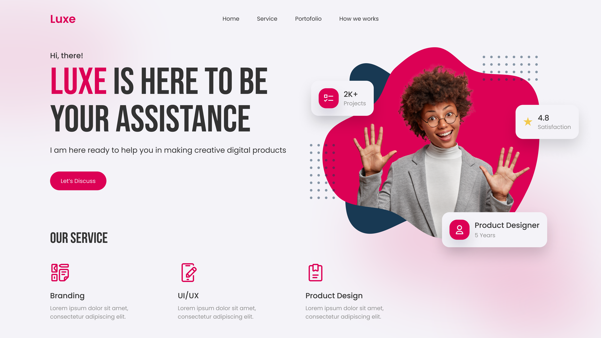

<h1 align="center" style="color: #0366d6;">
   HTML-CSS-SASS_Header_Personal_Porfolio
</h1>

This project showcases a practical example of my experience working with HTML and CSS, along with the integration of Sass to enhance code efficiency and organization. The design focuses on a header specifically created for a personal portfolio, optimized for screens up to 1200px wide.

## 📁 Repository Structure

The repository includes a functional header with links to various sections, designed to enhance the presentation of a personal portfolio. The following technologies are utilized in this project:

| Tecnología | Enlace |
|------------|--------|
| **HTML**   | |
| **CSS**    |   |
| **SASS**   | |

---

<h2 align="center">
  Header: Personal Porfolio 
</h2>

 

## 🛠️ Resources Used

🌐 Google Fonts: The fonts Poppins and Bebas Neue are integrated into the design to provide a modern and sophisticated aesthetic.

- Poppins, with its clean and geometric style, ensures excellent readability.
- Bebas Neue, with its bold and condensed appearance, adds a touch of distinction and visual dynamism.

## Contributions 🤝

Your participation is valuable! If you have ideas, improvements, or find any issues, feel free to:

- Open issues to report bugs or suggest improvements.
- Create pull requests to propose changes directly.
- Share your feedback and experiences to help refine these examples.

Every contribution counts towards building together. 🌟

## Professional Services 💼

I am available to work on web design projects, whether for individuals or businesses. Do you have a project in mind, or need assistance with your website?

Let’s talk and bring your digital vision to life! 🚀
 

## Licencia 📜

This project is licensed under the  [MIT] - Check the [LICENSE](LICENSE) file for more details.

---

<h1 align="center" style="color: #0366d6;">
   HTML-CSS-SASS_Header_Personal_Porfolio
</h1>

Este proyecto presenta un ejemplo práctico de mi experiencia trabajando con HTML y CSS, junto con la incorporación de Sass para mejorar la eficiencia y organización del código. El diseño se centra en un header creado específicamente para un portafolio personal, optimizado para adaptarse a pantallas de hasta 1200px de ancho.

## 📁 Contenido del Repositorio

El repositorio contiene un header funcional con enlaces a diferentes secciones, diseñado para realzar la presentación de un portafolio personal. En este proyecto se emplean las siguientes tecnologías:

| Tecnología | Enlace |
|------------|--------|
| **HTML**   | |
| **CSS**    |   |
| **SASS**   | |

---

<h2 align="center">
  Header: Personal Porfolio 
</h2>

 

## 🛠️ Recursos Utilizados

🌐 Google Fonts: Las fuentes Poppins y Bebas Neue se integran en el diseño para aportar una estética moderna y sofisticada. 
- Poppins, con su estilo geométrico y limpio, asegura una excelente legibilidad.  
- Bebas Neue, con su apariencia audaz y condensada, añade un toque de distinción y dinamismo visual.

## Contribuciones 🤝

¡Tu participación es valiosa! Si tienes ideas, mejoras o encuentras algún problema, siéntete libre de:

Abrir issues para reportar errores o sugerir mejoras.
Realizar pull requests para proponer cambios directamente.
Compartir tus comentarios y experiencias para ayudar a perfeccionar estos ejemplos.
Cada aportación cuenta para seguir construyendo juntos. 🌟

## Servicios Profesionales 💼

Estoy disponible para trabajar en proyectos de diseño web, ya sea para particulares o empresas. ¿Tienes un proyecto en mente o necesitas asistencia con tu sitio web?

¡Hablemos y hagamos realidad tu visión digital! 🚀
 

## Licencia 📜

Este proyecto está bajo la licencia [MIT] - Consulta el archivo [LICENSE](LICENSE) para más detalles.

